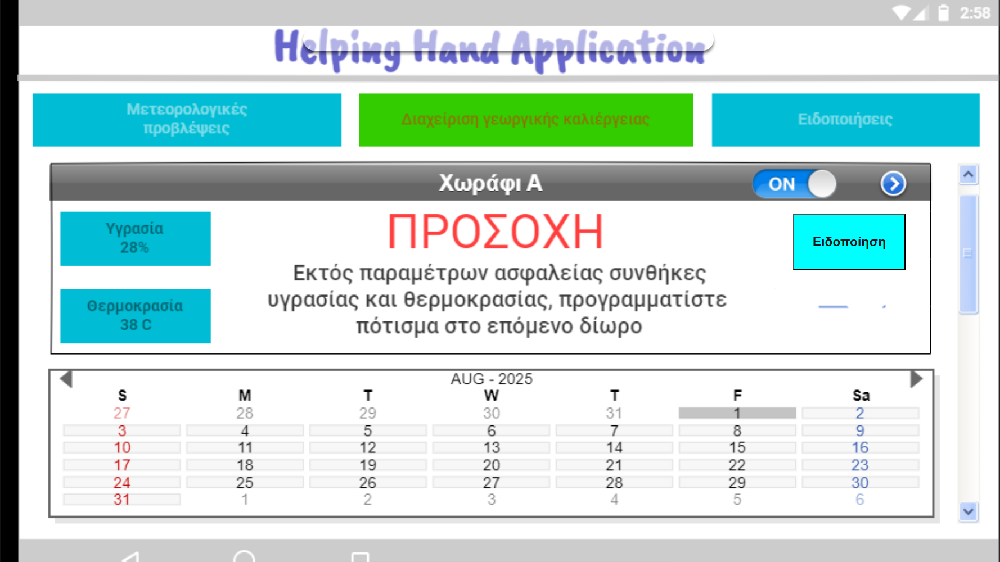

# Helpinh Hand Application
Η εφαρμογή βάσης την οποία εντοπίσαμε είναι το React-Weather-App το οποίο εντοπίσαμε σε public repository στο github στον ακόλουθο σύνδεσμο https://github.com/s-shemmee/React-Weather-App. Η συγκεκριμένη εφαρμογή κάνει της React και επιτρέπει στους χρήστες να αναζητούν ενημέρωση και πρόβλεψη για τις καιρικές συνθήκες που επικρατούν ή θα επικρατήσουν στις πόλεις ανά τον κόσμο. Η εφαρμογή φέρνει δεδομένα κάνοντας χρήση του API SheCodesWeather.

Από την αρχική εφαρμογή αφαιρέθηκαν λειτουργίες οι οποίες αξιολογήθηκαν ως πλεονασματικές για τις ανάγκες τις υλοποιούμενης διάδρασης.  Έγινε αλλαγή τις εικόνας υποβάθρου βάζοντας μια από τις οθόνες υποδείγματος που σχεδιάσαμε και προσθέσαμε ένα κουμπί για την αποστολή μηνυμάτων στους συνδεδεμένους χρήστες.
Η εικόνα υποβάθρου αρχικά ανέβηκε στο φάκελο images και πήρε το ίδιο όνομα με την αρχική εικόνα υποβάθρου ώστε να μην χρειαστούν επιπλέον αλλαγές στον κώδικα.
Στην συνέχεια προστέθηκε το κουμπί ¨Ειδοποίηση¨ με σκοπό να μπορεί να αποσταλεί ειδοποίηση στις συνδεδεμένες συσκευές. Η εισαγωγή του κουμπιού έγινε στο App.js στις γραμμές 7-9 και η μορφοποίηση του στο style.css στις γραμμές 28-40.
Το πάτημα του κουμπιού οδηγεί στην εμφάνιση ενός πλαισίου κειμένου για την εισαγωγή του κειμένου του προς αποστολή μηνύματος καθώς και στην εμφάνιση του κουμπιού «Αποστολή Μηνύματος». Οι αλλαγές έγιναν στις γραμμές 41-52 του App.jss και οι μορφοποιήσεις των συστατικών στις γραμμές 42-65 του style.css.
